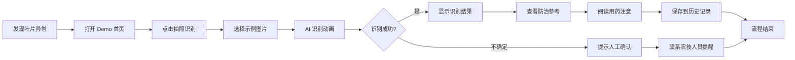

# 南部县AI柑橘病虫害识别工具 - 产品需求文档（PRD）

> 本 Demo 用于参赛展示，可在浏览器中直接体验完整交互流程。

## 1. 产品概述

- **一句话简介**：用 TRAE 给农民做一个揣兜里的 AI 植保小助手，让柑橘园里的一张病叶照片，也能尽快变成看得懂的初步判断和处理方向。
- **目标用户**：南部县柑橘种植户（尤其是缺乏专业植保知识的中老年农户）、基层农技推广员、柑橘产业园区管理者。
- **核心价值**：缓解基层农技服务"最后一公里"难题，让农民少花冤枉钱、少打冤枉药、少错过防治期；同时证明 TRAE 能帮助个人开发者快速做出面向乡村场景的公益小工具。

## 2. 核心功能

### 2.1 用户角色

| 角色 | 主要诉求 | 在 Demo 中的体现 |
|------|----------|------------------|
| 柑橘种植户 | 拍照快速识别病虫害、看懂防治建议 | 拍照上传 → 识别结果 → 防治参考主流程 |
| 基层农技推广员 | 查看历史识别记录、辅助诊断 | 历史记录页与置信度提示 |
| 产业园区管理者 | 了解病虫害高发趋势 | 数据看板统计模块 |

### 2.2 功能模块

1. **首页（识别入口）**：Hero 主视觉、拍照/上传入口、常见病虫害快捷卡片、公益承诺说明。
2. **拍照识别页**：模拟拍照/上传交互、AI 识别加载动画、识别结果展示（病虫害名称、置信度、识别依据）。
3. **防治参考页**：防治方向、用药注意事项、风险提示、人工确认提醒、保存到历史。
4. **历史记录页**：识别记录列表、按病虫害分类筛选、查看详情。
5. **数据看板页**：识别次数统计、常见病虫害占比、近期趋势可视化。
6. **关于页**：项目初心、与 TRAE 结合、使用边界、公益承诺。

### 2.3 页面详情

| 页面 | 模块 | 功能描述 |
|------|------|----------|
| 首页 | Hero 主视觉 | 柑橘园背景 + 主标题 + CTA 拍照按钮，进入识别流程 |
| 首页 | 常见病虫害 | 红蜘蛛、炭疽病、潜叶蛾、溃疡病卡片，点击查看示例 |
| 首页 | 公益承诺 | "基础识别功能长期免费"声明卡片 |
| 拍照识别页 | 拍照/上传区 | 模拟相机框 + 上传按钮 + 示例图片快速选择 |
| 拍照识别页 | AI 识别动画 | 扫描线动画 + "正在分析叶片纹理…"等进度文案 |
| 拍照识别页 | 识别结果 | 病虫害名称、置信度环形进度、识别依据三条要点 |
| 防治参考页 | 防治方向 | 农业防治 + 化学防治分块说明 |
| 防治参考页 | 用药注意 | 用药剂量、安全间隔期、混用禁忌 |
| 防治参考页 | 风险提示 | 严重情况需联系农技人员的提醒卡片 |
| 历史记录页 | 记录列表 | 时间、缩略图、病虫害名、置信度，可筛选查看 |
| 数据看板页 | 统计卡片 | 总识别次数、覆盖病虫害种类、本周新增 |
| 数据看板页 | 图表 | 病虫害占比饼图、近 7 天趋势折线（CSS/SVG 实现） |
| 关于页 | 项目初心 | 报名帖核心内容、TRAE 结合方式 |

## 3. 核心流程

**主识别流程**：农户在果园发现异常 → 打开 Demo 首页 → 点击"拍照识别" → 选择示例图片或模拟拍照 → AI 识别动画 → 显示识别结果（病虫害名 + 置信度 + 识别依据） → 查看"防治参考" → 阅读用药注意和风险提示 → 可选保存到历史记录。

## 4. 用户界面设计

### 4.1 设计风格

- **主题方向**：柑橘田园 + 公益温度 + 科技感。融合柑橘金黄、叶片翠绿、土壤暖棕，搭配深色背景突出 AI 科技感，避免常见的紫色渐变 AI 风。
- **主色调**：柑橘金 `#F59E0B`（主）、柑橘叶绿 `#16A34A`（辅）、深暖棕 `#1C1410`（背景）、米白 `#FAF6EE`（卡片）、警示橙红 `#DC2626`（风险提示）。
- **按钮风格**：圆角 12px，主按钮柑橘金渐变带轻微阴影；次按钮描边样式；触感按压有缩放反馈。
- **字体**：标题用 `ZCOOL XiaoWei`（站酷小薇，温暖人文气质），正文用 `Noto Sans SC`（清晰易读，适合中老年用户大字号）。展示数字用 `Space Grotesk`。
- **布局**：桌面端居中卡片式，最大宽度 1200px；移动端单列大按钮、大字号、大间距，照顾中老年农户。
- **图标/插画**：使用柑橘、叶片、虫害的简化 SVG 插画，配合 lucide 图标体系。
- **微交互**：拍照扫描线动画、置信度环形进度填充、卡片悬停轻微上浮、页面切换淡入。

### 4.2 页面设计概览

| 页面 | 模块 | UI 元素 |
|------|------|---------|
| 首页 | Hero | 柑橘园渐变背景 + 颗粒纹理 + 大标题 + CTA 按钮 + 浮动叶片装饰 |
| 首页 | 病虫害卡片 | 4 张卡片网格，含 SVG 插画、名称、简介、示例按钮 |
| 拍照识别页 | 相机区 | 模拟取景框 + 扫描线动画 + 上传/示例按钮 |
| 识别结果 | 置信度环 | SVG 环形进度条 + 病虫害名 + 识别依据列表 |
| 防治参考 | 分块卡片 | 农业防治（绿）、化学防治（金）、风险提示（红） |
| 数据看板 | 图表区 | SVG 饼图 + CSS 柱状/折线图 |
| 关于 | 时间线 | TRAE 结合方式四步流程时间线 |

### 4.3 响应式

- **桌面优先**：1280px+ 双列布局，看板可横向展示图表。
- **移动自适应**：≤768px 单列、字号放大、按钮全宽、底部固定导航。
- **触控优化**：所有可点击区域 ≥ 48px，照顾戴手套或手指粗糙的农户。

### 4.4 3D 场景

本项目不使用 3D 场景，聚焦 2D 交互体验与插画式视觉。
