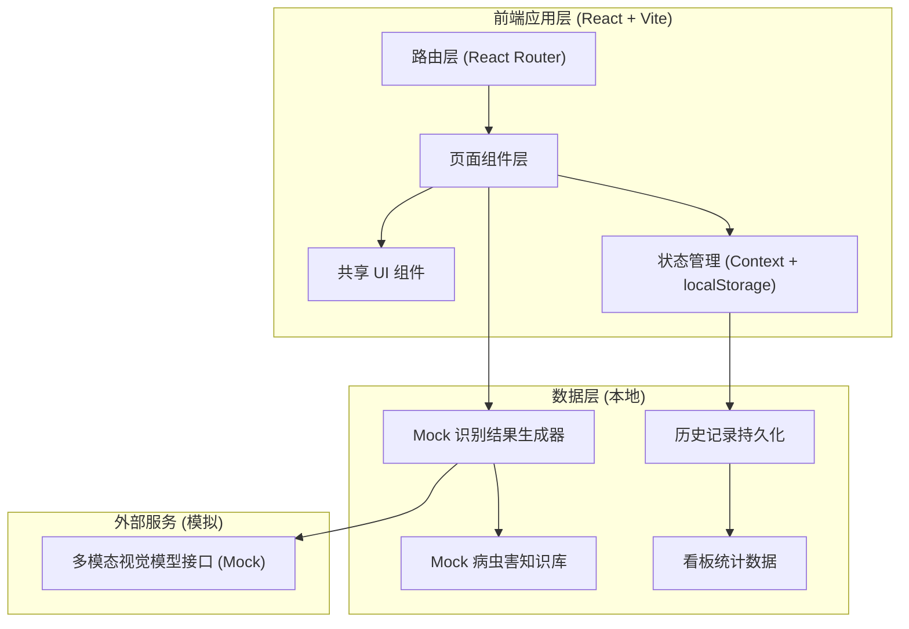

# 南部县AI柑橘病虫害识别工具 - 技术架构文档

> 本 Demo 为参赛展示用前端原型，不连接真实后端模型，使用本地 Mock 数据模拟识别流程。

## 1. 架构设计



## 2. 技术说明

- **前端框架**：React@18 + Vite@5，快速热更新、生态成熟。
- **样式方案**：TailwindCSS@3 + 自定义 CSS 变量主题，配合 Google Fonts（ZCOOL XiaoWei / Noto Sans SC / Space Grotesk）。
- **图标**：lucide-react，简洁线性，契合植保科技感。
- **路由**：react-router-dom@6，多页面切换。
- **动画**：Framer Motion（页面过渡 + 元素入场动画）+ CSS keyframes（扫描线、环形进度）。
- **图表**：纯 SVG/CSS 实现，无重型图表库，体积小、可控样式。
- **数据持久化**：localStorage 存历史记录与统计，刷新不丢失。
- **后端**：无（Demo 使用本地 Mock 数据，模拟多模态视觉模型返回）。

## 3. 路由定义

| 路由 | 用途 |
|------|------|
| `/` | 首页：Hero、拍照入口、常见病虫害卡片、公益承诺 |
| `/scan` | 拍照识别页：上传/示例 → AI 识别动画 → 识别结果 |
| `/advice/:id` | 防治参考页：防治方向、用药注意、风险提示 |
| `/history` | 历史记录页：识别记录列表与筛选 |
| `/dashboard` | 数据看板页：统计卡片与图表 |
| `/about` | 关于页：项目初心与 TRAE 结合 |

## 4. 数据模型（本地 Mock）

### 4.1 病虫害知识库

```typescript
interface Pest {
  id: string;              // 如 "red-spider"
  name: string;            // "红蜘蛛"
  category: "虫害" | "病害";
  severity: "轻" | "中" | "重";
  description: string;     // 简介
  symptoms: string[];      // 典型症状要点
  recognitionBasis: string[]; // 识别依据（展示给农户）
  prevention: {
    agricultural: string[]; // 农业防治
    chemical: string[];     // 化学防治
    cautions: string[];     // 用药注意
  };
  riskNote: string;        // 风险提示
  accentColor: string;     // 卡片主色
  illustration: "spider" | "anthracnose" | "leafminer" | "canker";
}
```

### 4.2 识别记录

```typescript
interface ScanRecord {
  id: string;
  pestId: string;
  pestName: string;
  confidence: number;       // 0-100
  thumbnail: string;        // 示例图缩略 key
  createdAt: number;        // 时间戳
  location?: string;        // 可选地点
}
```

### 4.3 初始数据

内置 4 种南部县常见柑橘病虫害：红蜘蛛、炭疽病、潜叶蛾、溃疡病。每种含完整识别依据与防治参考。看板统计数据基于内置示例 + 用户实际识别记录动态聚合。

## 5. 关键交互说明

- **拍照识别流程**：用户选择示例图（或上传本地图片）→ 进入扫描动画 2.5s → 根据所选示例图返回对应病虫害识别结果（带置信度）→ 可继续查看防治参考或保存到历史。
- **置信度展示**：SVG 环形进度条，从 0 动画填充到目标值；不同区间颜色不同（≥80% 绿、60-79% 金、<60% 橙红并提示人工确认）。
- **历史记录**：每次识别完成可选保存；按时间倒序展示；支持按病虫害名筛选。
- **看板统计**：从 localStorage 读取历史记录聚合；初次访问注入示例数据使看板不为空。
